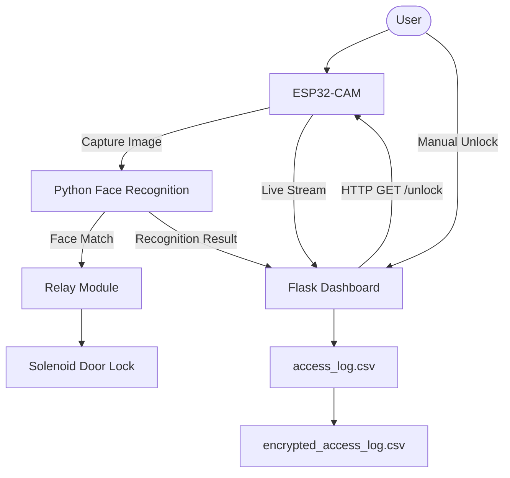

# 🔐 Smart Lock with Face Recognition (ESP32-CAM + Flask Dashboard)

[](https://www.espressif.com/)
[](https://www.python.org/)
[](https://flask.palletsprojects.com/)
[](https://en.wikipedia.org/wiki/Advanced_Encryption_Standard)
[]()

> **Proyek UAS Mata Kuliah Mikrokontroler** — Sistem keamanan pintu pintar berbasis **ESP32-CAM**, **Python Face Recognition**, **Flask Dashboard**, **HTTP Communication**, dan **AES-128 Encryption**. Sistem mampu mengenali wajah pengguna secara otomatis, membuka pintu melalui relay dan solenoid, serta memantau seluruh aktivitas melalui dashboard web secara realtime.

---

# 👥 Kelompok 5

| Nama                               | NPM         |
| ---------------------------------- | ----------- |
| **Daniel Desmanto Nugraha**        | 23552011055 |
| **Dzikri Tsani Ramadhan Nurjamil** | 23552011367 |

---

# 📑 Daftar Isi

* Deskripsi
* Fitur Utama
* Komponen Hardware
* Software yang Digunakan
* Arsitektur Sistem
* Struktur Project
* Cara Kerja Sistem
* Instalasi
* Cara Menjalankan
* Nilai Tambah (Bonus)
* Screenshot
* Lisensi

---

# 📖 Deskripsi

**Smart Lock with Face Recognition** merupakan sistem keamanan pintu otomatis yang menggunakan **ESP32-CAM** sebagai kamera utama untuk menangkap citra wajah pengguna.

Proses **Face Recognition** dilakukan menggunakan library **face_recognition** pada Python. Apabila wajah dikenali sebagai pengguna yang terdaftar, aplikasi akan mengirimkan permintaan HTTP ke ESP32-CAM untuk mengaktifkan relay sehingga **solenoid door lock** terbuka secara otomatis.

Selain itu, sistem menyediakan **dashboard berbasis Flask** yang mampu:

* 📷 Menampilkan live stream ESP32-CAM.
* 🔓 Membuka pintu secara manual.
* 👤 Menampilkan wajah terakhir yang dikenali.
* 📊 Menampilkan statistik akses.
* 📝 Menampilkan log akses secara realtime menggunakan AJAX.
* 🔒 Menyimpan log terenkripsi menggunakan AES-128.
* 💾 Menyimpan seluruh riwayat akses ke file CSV.

---

# ✨ Fitur Utama

| Fitur                 | Keterangan                                                |
| --------------------- | --------------------------------------------------------- |
| 👤 Face Recognition   | Menggunakan library `face_recognition` berbasis dlib      |
| 📷 Live Stream        | Menampilkan video realtime dari ESP32-CAM                 |
| 🚪 Auto Unlock        | Relay aktif otomatis ketika wajah dikenali                |
| 🖱 Manual Unlock      | Membuka pintu melalui dashboard                           |
| 📊 Dashboard Realtime | Menggunakan AJAX tanpa refresh halaman                    |
| 👤 Last Face Capture  | Menampilkan foto wajah terakhir yang dikenali             |
| 📄 CSV Logging        | Menyimpan seluruh aktivitas ke `access_log.csv`           |
| 🔒 AES-128 Encryption | Menyimpan log terenkripsi pada `encrypted_access_log.csv` |
| 🌐 HTTP Communication | Komunikasi antara Python dan ESP32-CAM                    |

---

# 🔧 Komponen Hardware

| Qty      | Komponen                | Fungsi                   |
| -------- | ----------------------- | ------------------------ |
| 1        | ESP32-CAM AI Thinker    | Kamera dan web server    |
| 1        | ESP32-CAM MB Programmer | Upload program           |
| 1        | Relay 1 Channel 5V      | Mengendalikan solenoid   |
| 1        | Solenoid Door Lock 12V  | Mekanisme pengunci pintu |
| 1        | Holder Baterai 3x18650  | Catu daya solenoid       |
| 3        | Baterai 18650           | Power supply             |
| 1        | Dioda Flyback           | Proteksi relay           |
| 1        | Breadboard              | Perakitan rangkaian      |
| Beberapa | Kabel Jumper            | Koneksi antar komponen   |

> Relay dikendalikan menggunakan **GPIO13** pada ESP32-CAM.

---

# 💻 Software yang Digunakan

* Arduino IDE
* Python 3.12
* Flask
* OpenCV
* face_recognition
* NumPy
* Requests
* PyCryptodome
* GitHub

---

# 🏗 Arsitektur Sistem



---

# 📁 Struktur Project

```text
smartlock-dashboard/
│
├── app.py                     # Flask Dashboard
├── config.py                  # Konfigurasi sistem
├── crypto_utils.py            # AES-128 Encryption
├── face_service.py            # Background Face Recognition
├── face_utils.py              # Load dataset & recognition
│
├── dataset/
│   ├── 1.jpg
│   ├── 2.jpg
│   ├── 3.jpg
│   ├── 4.jpg
│   └── 5.jpg
│
├── templates/
│   └── dashboard.html
│
├── static/
│   ├── style.css
│   ├── script.js
│   └── last_face.jpg
│
├── esp32/
│   └── smartlock_final/
│
├── access_log.csv
├── encrypted_access_log.csv
├── requirements.txt
├── README.md
│
└── archive/
    ├── test_face.py
    ├── test_unlock.py
    └── face_unlock.py
```

---

# ⚙ Cara Kerja Sistem

1. ESP32-CAM menangkap gambar wajah pengguna.
2. Python mengambil gambar melalui endpoint **`/capture`**.
3. Face Recognition membandingkan wajah dengan dataset yang telah didaftarkan.
4. Jika wajah dikenali:

   * Mengirim HTTP Request ke endpoint **`/unlock`** pada ESP32-CAM.
   * Relay aktif.
   * Solenoid membuka pintu.
5. Dashboard Flask menerima hasil deteksi.
6. Dashboard diperbarui secara otomatis menggunakan AJAX.
7. Log akses disimpan ke:

   * `access_log.csv`
   * `encrypted_access_log.csv`

---

# 🚀 Instalasi

Clone repository:

```bash
git clone https://github.com/USERNAME/smartlock-dashboard.git
cd smartlock-dashboard
```

Install seluruh dependency:

```bash
pip install -r requirements.txt
```

---

# ▶ Cara Menjalankan

Pastikan:

* ESP32-CAM telah terhubung ke WiFi.
* IP ESP32 telah disesuaikan pada `config.py`.
* Dataset wajah berada pada folder `dataset/`.

Jalankan aplikasi:

```bash
python app.py
```

Buka browser:

```
http://127.0.0.1:5000
```

---

# ⭐ Nilai Tambah (Bonus)

✅ Face Recognition (Machine Learning)

✅ ESP32-CAM Live Stream

✅ Flask Dashboard

✅ Dashboard Realtime (AJAX)

✅ Auto Unlock Door

✅ Manual Unlock

✅ Last Face Capture

✅ AES-128 Encryption

✅ CSV Access Log

✅ HTTP Communication

---

# 📷 Screenshot

Tambahkan screenshot berikut:


---

# 📄 Lisensi

Proyek ini dibuat untuk memenuhi tugas **UAS Mata Kuliah Mikrokontroler** Program Studi Teknik Informatika, Universitas Teknologi Bandung.

Penggunaan diperbolehkan untuk tujuan pembelajaran dengan tetap mencantumkan sumber.
